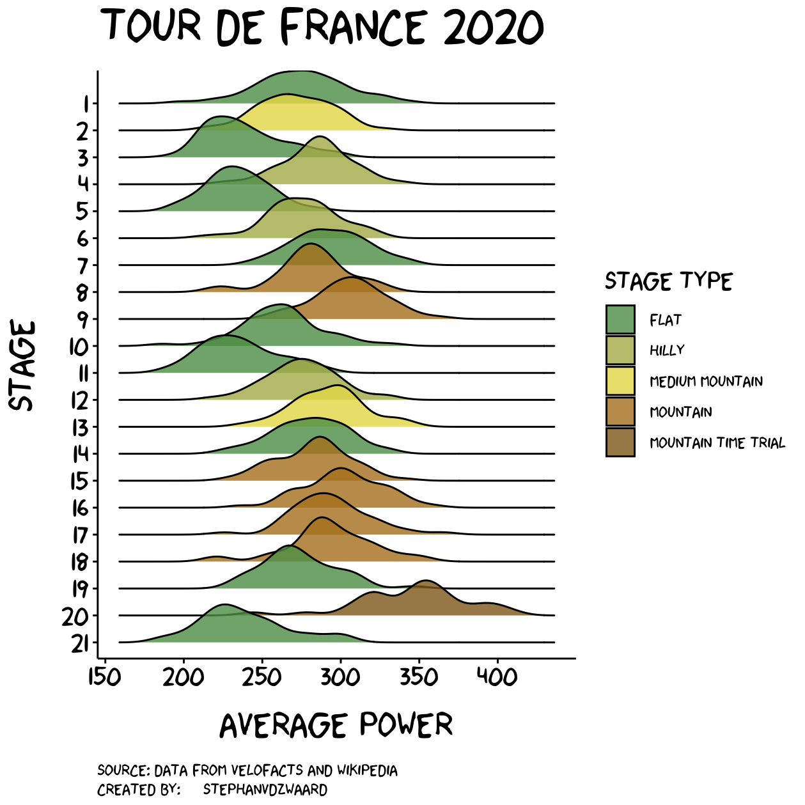

# TdF2020
Visualisation of the Tour de France 2020

---

This repository contains power data obtained by [velofacts](https://twitter.com/velofacts) and the script to scrape data from [Wikipedia](https://en.wikipedia.org/wiki/2020_Tour_de_France) and create the data visualization of the Tour de France 2020. 

### Data Visualization
Code: script/main_script_tdf.R

### Power output distribution per stage (density plot)
